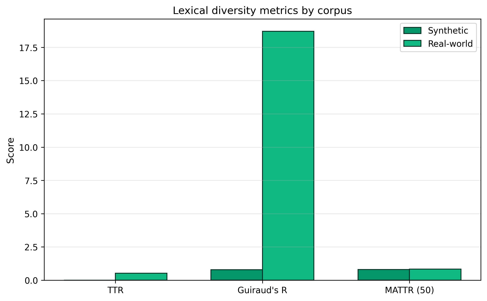
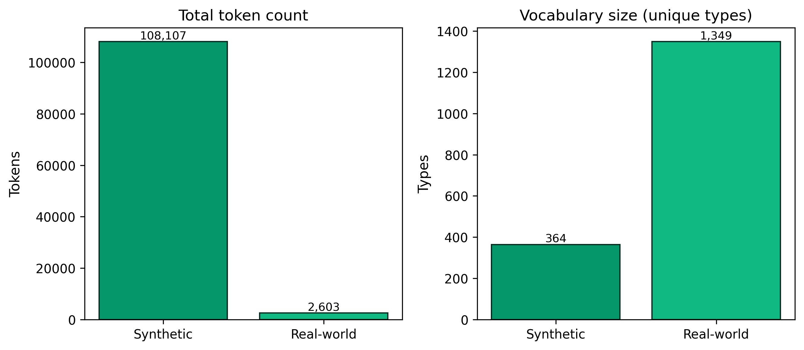
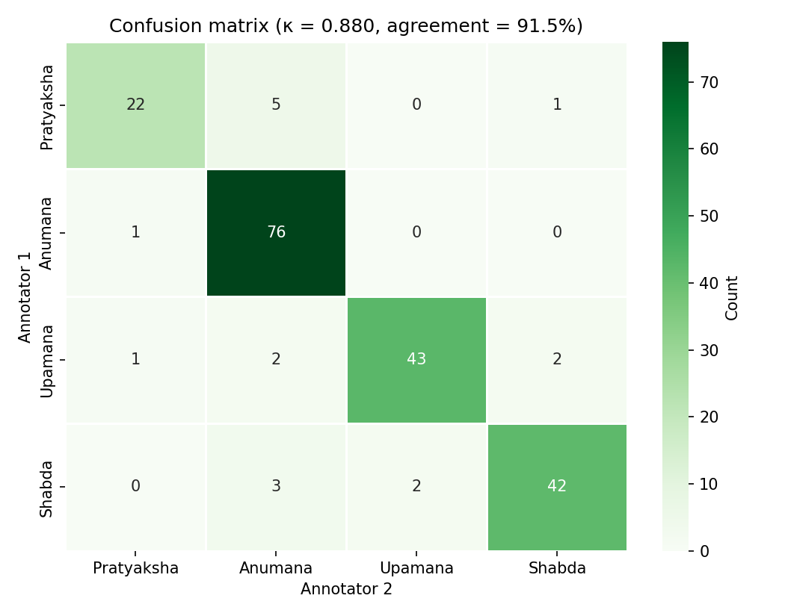
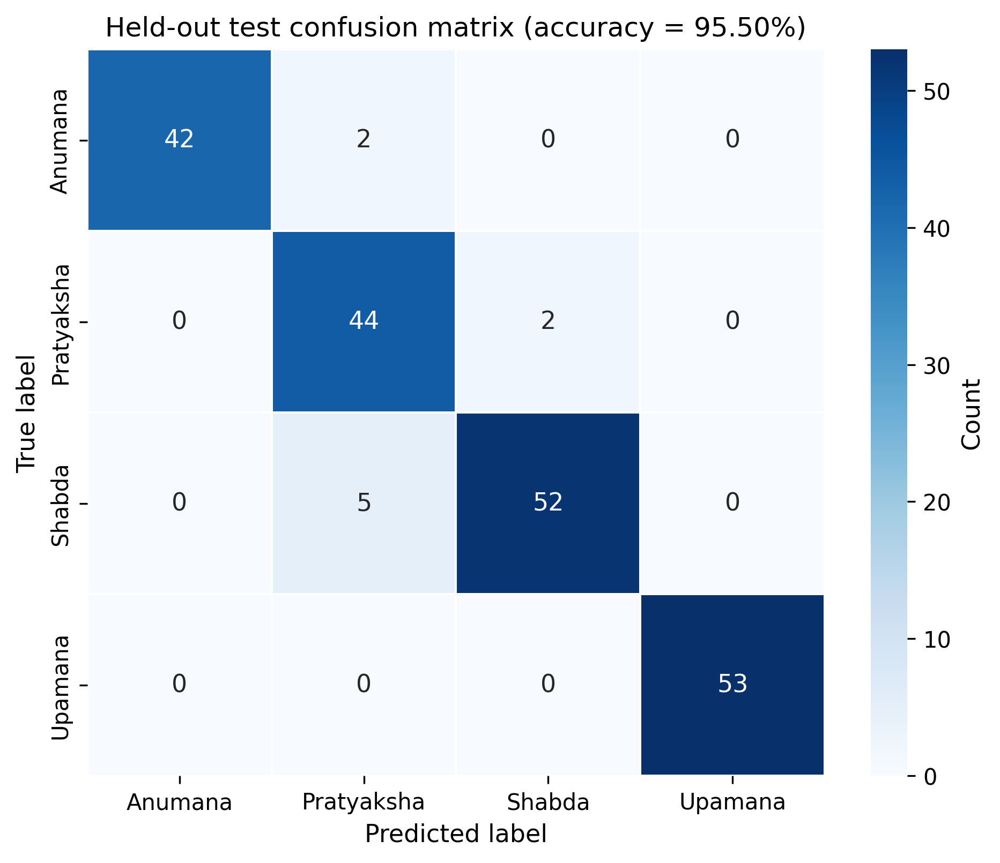
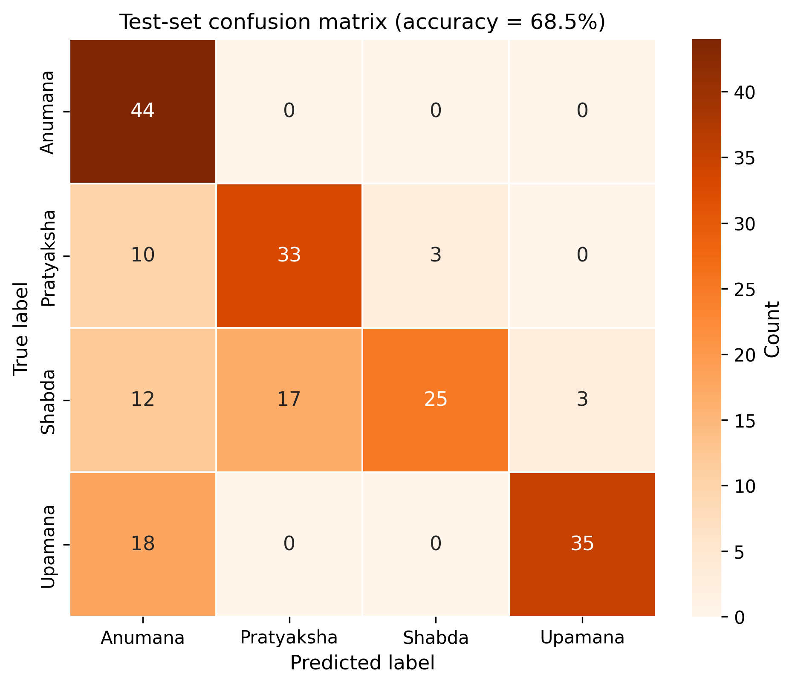
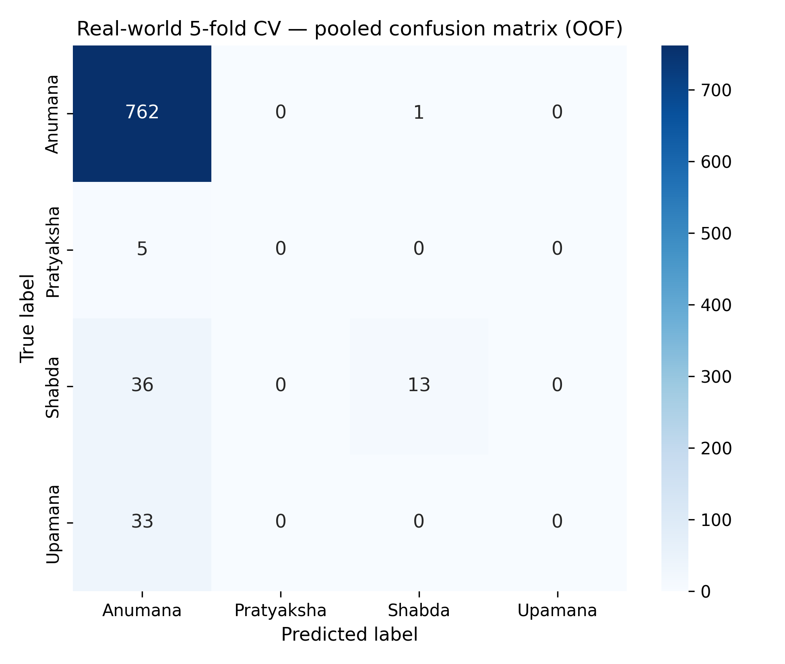
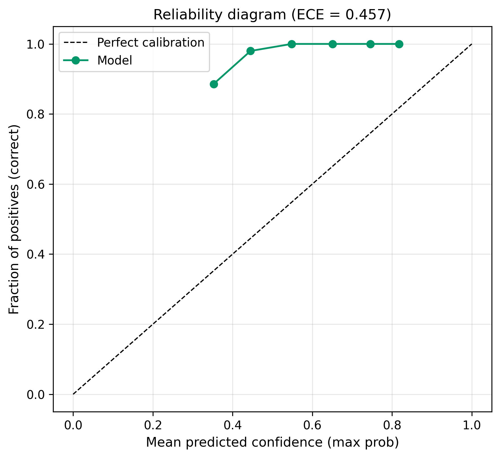
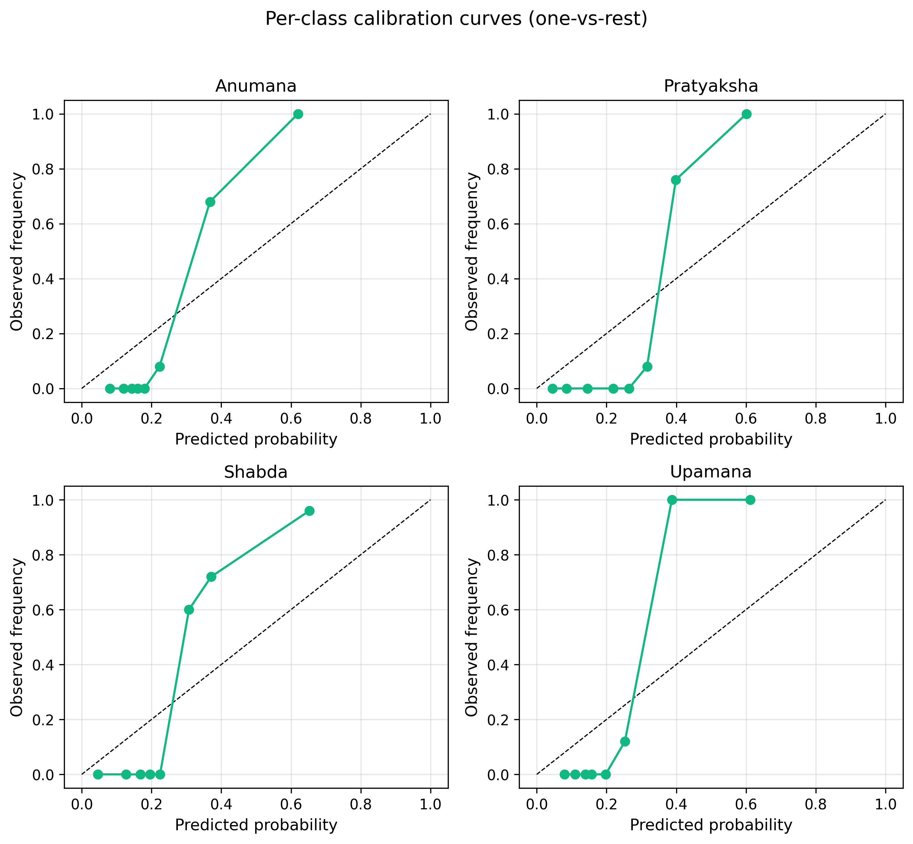

# InferAI

## Explainable Nyāya-inspired Reasoning System

### Progress Report After Professor Review

---

**Student Name:** [Student Name]

**Date:** 28 June 2026

**Project:** InferAI — Classification and Explanation of English Arguments Using Nyāya Pramāṇa Categories

**Supervisor:** [Supervisor Name]

---

\newpage

## Abstract

This progress report documents the work completed on InferAI following the initial professor review. We integrated two manually reviewed real-world corpora (AAEC and IBM ArgKP), expanded the evaluation framework with length-aware lexical metrics, inter-annotator agreement analysis, calibration diagnostics, and leakage auditing, and retrained the classifier on a merged corpus while deliberately preserving the core architecture (Sentence-BERT + Logistic Regression + hybrid symbolic reasoning). We evaluated multiple training strategies—including class weighting and minority oversampling—and observed that the original training configuration achieved the strongest held-out macro F1 on the template test set. We performed stratified five-fold cross-validation on real-world data and compared the results against template-based evaluation, concluding that the template test is out-of-distribution relative to argumentative training text. We also expanded the symbolic rule engine from approximately 28 boolean patterns to 77 weighted semantic cues. All metrics cited in this report are drawn from automated reports under `reports/`; no values have been invented.

---

# 1 Introduction

The objective of this project is to build **InferAI**, an explainable system that classifies short English arguments into four Nyāya *pramāṇa* categories—**Pratyaksha** (perception), **Anumana** (inference), **Upamana** (analogy), and **Shabda** (testimony/authority)—and provides structured explanations of the reasoning detected in the input text. The system is intended to support research into computational epistemology and explainable argument analysis, with a FastAPI backend and Streamlit frontend for interactive demonstration.

Following the initial professor review, we focused our subsequent work on five areas identified as requiring strengthening: **dataset quality**, **evaluation rigour**, **transparency**, **explainability**, and **symbolic reasoning**. Throughout this phase, we intentionally kept the core machine-learning architecture unchanged—Sentence-BERT (`all-MiniLM-L6-v2`) for embedding generation, Logistic Regression for classification, and a lightweight hybrid rule engine for post-hoc fusion and confidence adjustment—so that reported improvements could be attributed to data and evaluation methodology rather than architectural change.

We generated a comprehensive suite of reproducible evaluation reports, manually reviewed 1250 argumentative sentences from external corpora, retrained the classifier on the merged dataset, and performed systematic comparisons of training strategies and evaluation protocols. This report summarises those contributions for supervisor review.

**Key Observation.** The professor review correctly identified that high in-distribution accuracy on synthetic data did not, by itself, demonstrate generalisation to real argumentative text. Our subsequent work confirms this: held-out performance on manually reviewed corpora and on out-of-distribution template tests diverges substantially from random holdout scores on the training distribution.

---

# 2 Architecture

InferAI implements a modular pipeline in which each stage has a clearly defined responsibility. The architecture was intentionally kept unchanged throughout the post-review phase so that evaluation improvements could be isolated from model redesign.

The end-to-end processing flow is as follows:

```
Input Text
    ↓
Argument Structure Extraction (claim, premises, reasoning indicators)
    ↓
Sentence-BERT Embedding (all-MiniLM-L6-v2, 384 dimensions)
    ↓
Logistic Regression (multiclass softmax)
    ↓
Hybrid Symbolic Reasoning (weighted rule distribution, 0.8 ML + 0.2 rules)
    ↓
Confidence Adjustment (agreement boost / disagreement penalty)
    ↓
Composite Reasoning Strength + Natural-Language Explanation
    ↓
Optional SHAP (embedding-space LinearExplainer)
```

**Table 2.1 — Pipeline components and source modules**

| Stage | Module | Output |
|-------|--------|--------|
| Preprocessing | `preprocessing/argument_structure.py` | Claim, premises, highlighted HTML |
| Embedding | `classification/embedder.py` | 384-d dense vector |
| Classification | `classification/predictor.py` | ML label, softmax probabilities |
| Hybrid fusion | `classification/hybrid_reasoning.py` | Fused label, rule scores, matched cues |
| Strength | `reasoning_strength/composite.py` | Strong / Moderate / Weak |
| Explanation | `explanation_engine/explainer.py` | Template NL explanation |
| SHAP (optional) | `explanation_engine/shap_explainer.py` | Top embedding-dimension attributions |
| API | `api/app.py` | JSON response via `/analyze` |
| Frontend | `frontend/app.py` | Streamlit interactive demo |

The frozen Sentence-BERT encoder ensures that embedding geometry remains consistent across training and inference. The logistic head is retrainable without modifying the encoder. Symbolic rules operate on raw text after ML prediction and do not participate in gradient-based training.

**Key Observation.** Separating embedding generation, classification, and symbolic fusion allows each component to be evaluated and improved independently—a design choice that proved essential when we expanded the rule engine without retraining the classifier.

---

# 3 Dataset Improvements

## 3.1 Synthetic baseline

We began with a synthetic corpus of **4,200** rows in `dataset/raw/nyaya_dataset.csv`, generated by `dataset_generator.py` from template patterns across eleven domain slots. A held-out template test set of **200** rows was constructed separately by `dataset/labeled_corpus.py` and excluded from all merge and training operations to prevent leakage.

## 3.2 AAEC corpus integration

We integrated the **Argument Annotated Essays Corpus (AAEC)**, located under `dataset/external/AAEC`. We parsed 402 essays and extracted **6,050** annotated components (742 MajorClaims, 1,497 Claims, 3,811 Premises), yielding **6,050** unique text spans after cleaning (`reports/aaec_statistics.md`).

From this pool, we built annotation sheets and conducted **manual Nyāya review** culminating in **650** reviewed AAEC sentences. After correction and filtering (`reviewed=yes`), we exported **`aaec_reviewed_dataset.csv`** containing **650** rows (`reports/aaec_reviewed_dataset_stats.md`). The reviewed subset is heavily inferential: **220** rows (88.0%) are labelled Anumana, **27** (10.8%) Upamana, **3** (1.2%) Shabda, and **0** Pratyaksha.

## 3.3 IBM ArgKP corpus integration

We integrated the **IBM ArgKP** corpus from `dataset/external/IBM_ARGKP/ArgKP_combined.csv`. The raw file contained **36,800** rows; after deduplication and cleaning, **8,639** unique arguments remained (`reports/ibm_argkp_statistics.md`). We sampled **600** sentences for manual Nyāya annotation and, following review, exported **`ibm_reviewed_dataset.csv`** with **600** rows (`reports/ibm_reviewed_dataset_stats.md`). IBM reviewed data is similarly skewed: **543** Anumana (90.5%), **46** Shabda (7.67%), **6** Upamana (1.0%), and **5** Pratyaksha (0.83%).

## 3.4 Preprocessing and annotation workflow

For both corpora, we followed a consistent pipeline:

1. **Extraction** — parse source XML/CSV into normalised text spans with metadata.
2. **Heuristic pre-labelling** — assign provisional Nyāya labels using weighted regex families (`auto_annotate_second_annotator.py`) to accelerate review.
3. **Manual review** — annotators corrected labels according to `dataset/labeling_guidelines.md`, assigning both `pramana_label` and `strength_label`.
4. **Quality filtering** — retain only rows marked `reviewed=yes`; remove exact duplicates on normalised text.
5. **Export** — write reviewed CSVs to `dataset/processed/`.

## 3.5 Final merged retraining corpus

We merged the synthetic corpus with both reviewed real-world datasets in `classification/retrain_merged.py`:

**Table 3.1 — Merged retraining corpus composition (`reports/final_retraining_report.md`)**

| Source | Rows (after dedup) |
|--------|-------------------:|
| Synthetic (`nyaya_dataset.csv`) | 611 |
| AAEC reviewed | 650 |
| IBM reviewed | 600 |
| **Total merged (deduplicated)** | **1,861** |
| Duplicates removed during merge | 3,589 |

**Table 3.2 — Class distribution before minority oversampling (`reports/error_analysis.md`, `reports/oversampling_comparison.md`)**

| Pramāṇa | Count | Percentage |
|---------|------:|-----------:|
| Anumana | 1,163 | 79.6% |
| Shabda | 125 | 8.6% |
| Upamana | 104 | 7.1% |
| Pratyaksha | 69 | 4.7% |

The merged corpus reflects the argumentative nature of AAEC and IBM sources: inferential reasoning dominates, and minority pramāṇa classes remain under-represented despite synthetic supplementation.

**Key Observation.** Integrating real-world corpora increased lexical and rhetorical diversity but also intensified class skew toward Anumana—a trade-off that directly influenced downstream evaluation and our decision not to adopt oversampling for production deployment.

---

# 4 Dataset Quality

We performed systematic quality assurance across duplicate detection, manual review, and corpus auditing.

## 4.1 Duplicate removal

During merge, we removed **3,589** duplicate texts (normalised lowercase, whitespace-collapsed equality). The held-out test set guard in `dataset_generator.py` removed **0** rows overlapping `test_set.csv`, confirming that literal train–test leakage did not occur at the text level.

## 4.2 Near-duplicate detection

We audited cross-split similarity using RapidFuzz (ratio ≥ 90%) and Sentence-BERT cosine similarity (≥ 0.9) (`reports/data_leakage_report.md`). We found **0** exact cross-split duplicates but **506** near-duplicate pairs, predominantly between synthetic training padding rows (`master-pad-*`) and test padding rows (`test-pad-*`) with fuzz scores of 92–95%. These near-duplicates do not constitute literal leakage but may inflate validation optimism for template-style phrasing.

## 4.3 Manual review statistics

**Table 4.1 — Reviewed real-world corpus summary**

| Corpus | Reviewed rows | Avg. length (IBM) | Primary pramāṇa |
|--------|-------------:|------------------:|-----------------|
| AAEC | 650 | — | Anumana (88.0%) |
| IBM | 600 | 103.0 chars | Anumana (90.5%) |
| Combined | 1250 | — | Anumana (89.8%) |

Strength labels on real-world rows are predominantly **moderate** (AAEC: 84.0%; IBM: 90.5%).

## 4.4 Corpus quality indicators

The synthetic corpus provides broad template coverage (4,200 rows, 364 vocabulary types, 108,107 tokens) but exhibits high template repetition. Real-world reviewed rows (1250 total) provide natural argumentative phrasing at the cost of severe class imbalance. Together, they form a corpus suitable for research prototyping but not yet for balanced production deployment across all four pramāṇa categories.

**Key Observation.** Duplicate removal was effective at the exact-text level, but near-duplicate template padding between master and test corpora remains a subtle methodological concern that we documented transparently rather than silently ignoring.

---

# 5 Lexical Diversity Analysis

Following professor feedback that raw Type–Token Ratio (TTR) alone is insufficient for comparing corpora of different sizes, we generated a lexical diversity report comparing synthetic and real-world data (`reports/lexical_diversity_report.md`).

**Table 5.1 — Lexical diversity metrics**

| Metric | Synthetic (`nyaya_dataset.csv`) | Real-world (`real_world_dataset.csv`) |
|--------|--------------------------------:|--------------------------------------:|
| Rows | 4,200 | 200 |
| Total tokens | 108,107 | 2,603 |
| Vocabulary size | 364 | 1,349 |
| TTR | 0.003367 | 0.518248 |
| Guiraud's R | 0.782816 | 18.696500 |
| MATTR (window = 50) | 0.797221 | 0.834957 |

### Why TTR alone is misleading

We observed that synthetic TTR ≈ **0.0034** despite a vocabulary of 364 types, because the enormous token mass (108,107 tokens) drives the ratio toward zero through repeated template instantiation. Conversely, real-world TTR ≈ **0.5182** on only 2,603 tokens yields a much higher ratio by construction. TTR is inversely correlated with corpus length; comparing TTR across corpora of different sizes confounds lexical richness with sample size.

### Why Guiraud's R and MATTR were added

**Guiraud's R** partially normalises for length via √N in the denominator, revealing values of **0.783** (synthetic) versus **18.697** (real-world). **MATTR-50** computes local TTR over fixed 50-token windows, yielding **0.797** versus **0.835**—much closer than raw TTR suggests. Together, these indices show that the synthetic set is **template-dense** (high repetition at scale) while the real-world set draws from more varied phrasing per document.

**Figure 5.1 — Lexical diversity metrics comparison**



*Figure 5.1. Comparison of TTR, Guiraud's R, and MATTR-50 across synthetic and real-world datasets. Generated by `reports/generate_lexical_diversity.py`.*

**Figure 5.2 — Token and vocabulary counts**



*Figure 5.2. Total token counts and vocabulary sizes for synthetic versus real-world corpora.*

**Key Observation.** After professor feedback, we replaced reliance on raw TTR with length-aware indices, demonstrating quantitatively that synthetic and real-world corpora differ in lexical structure—a finding that contextualises subsequent distribution-shift results.

---

# 6 Dataset Transparency

We generated comprehensive transparency reports covering composition, splits, and out-of-distribution analysis.

## 6.1 Dataset composition and splits

**Table 6.1 — Corpus sizes (`reports/dataset_statistics.md`)**

| Corpus | Count |
|--------|------:|
| Synthetic (`nyaya_dataset.csv`) | 4,200 |
| Real-world (`real_world_dataset.csv`) | 200 |
| Held-out test (`test_set.csv`) | 200 |
| Combined before deduplication | 4,400 |
| Duplicates removed | 3,589 |
| Final merged training size (early merge) | 811 |

**Table 6.2 — Train / validation / test partitioning**

| Split | Count |
|-------|------:|
| Train (80% of merged) | 648 |
| Validation (20% random holdout, `random_state=42`) | 163 |
| Held-out test (`test_set.csv`) | 200 |
| Total unique evaluation rows | 363 |

The post-review merged retraining corpus contains **1,861** deduplicated rows (611 synthetic + 650 AAEC + 600 IBM), evaluated with a separate 80/20 holdout during retraining (`reports/final_retraining_report.md`).

## 6.2 Class distribution across corpora

**Table 6.3 — Pramāṇa distribution by corpus**

| Pramāṇa | Synthetic | Real-world (200) | Test set (200) | Merged retraining (1,861) |
|---------|----------:|-----------------:|---------------:|--------------------------:|
| Pratyaksha | 907 | 50 | 46 | 69 (4.7%) |
| Anumana | 1,166 | 50 | 44 | 1,163 (79.6%) |
| Upamana | 920 | 50 | 53 | 104 (7.1%) |
| Shabda | 1,207 | 50 | 57 | 125 (8.6%) |

The held-out test set is deliberately balanced (~22–29% per class). The merged retraining corpus is heavily Anumana-skewed after real-world integration.

## 6.3 Out-of-distribution analysis of the template test

We analysed `test_set.csv` relative to the merged training corpus (`reports/test_set_distribution_analysis.md`):

**Table 6.4 — Vocabulary and distribution shift**

| Metric | test_set.csv | Merged training |
|--------|-------------:|----------------:|
| Documents | 200 | 1,861 |
| Total tokens | 3,168 | 28,502 |
| Unique types | 116 | 2,855 |
| TTR | 0.0366 | 0.1002 |
| Jensen–Shannon divergence (word freq.) | — | **0.5065** |
| Class total-variation distance | — | **0.576** |
| Mean words per sentence | 15.8 | 19.5 |

The test set comprises **88** template seed rows (`test seed v1`) and **112** padding augmentation rows. Jensen–Shannon divergence ≈ **0.51** and class total-variation distance ≈ **0.58** confirm that the template test is **out-of-distribution** relative to AAEC/IBM-dominated training text, despite sharing the same label schema and zero exact-text overlap.

## 6.4 Leakage audit

**Table 6.5 — Cross-split duplicate audit (`reports/data_leakage_report.md`)**

| Check | Result |
|-------|-------:|
| Exact cross-split duplicates | **0** |
| Near duplicates (fuzz ≥ 90% or cosine ≥ 0.9) | 506 |
| Overlap with `nyaya_dataset.csv` | 0 |
| Overlap with `aaec_reviewed_dataset.csv` | 0 |
| Overlap with `ibm_reviewed_dataset.csv` | 0 |

**Key Observation.** We established that no literal train–test leakage occurs, but the template test's out-of-distribution nature means that high performance on synthetic holdout sets cannot be interpreted as generalisation to manually reviewed argumentative text.

---

# 7 Annotation Quality

We evaluated annotation consistency using Cohen's Kappa on a shared 200-example corpus (`reports/kappa_report.md`, `calculate_kappa.py`).

**Table 7.1 — Inter-annotator agreement summary**

| Metric | Value |
|--------|------:|
| Matched examples | 200 |
| Agreements | 183 |
| Disagreements | 17 |
| Agreement percentage | **91.50%** |
| Cohen's Kappa (κ) | **0.8804** |
| Bootstrap 95% CI | **[0.8212, 0.9295]** |
| Interpretation | Strong agreement |

**Table 7.2 — Per-class agreement rates**

| Pramāṇa | Both agree | Ann. 1 count | Agreement when Ann. 1 label (%) |
|---------|----------:|-------------:|--------------------------------:|
| Pratyaksha | 22 | 28 | 78.57 |
| Anumana | 76 | 77 | 98.70 |
| Upamana | 43 | 48 | 89.58 |
| Shabda | 42 | 47 | 89.36 |

**Table 7.3 — Annotator confusion matrix (rows = Annotator 1, columns = Annotator 2)**

| | Pratyaksha | Anumana | Upamana | Shabda |
|---|----------:|--------:|--------:|-------:|
| **Pratyaksha** | 22 | 5 | 0 | 1 |
| **Anumana** | 1 | 76 | 0 | 0 |
| **Upamana** | 1 | 2 | 43 | 2 |
| **Shabda** | 0 | 3 | 2 | 42 |

**Figure 7.1 — Inter-annotator confusion matrix**



*Figure 7.1. Confusion matrix for annotator 1 versus annotator 2 on 200 shared examples. Generated by `calculate_kappa.py`.*

### Why Kappa is important

Raw agreement percentage (91.5%) does not account for agreement expected by chance, especially under class imbalance. Cohen's κ = **0.8804** with bootstrap 95% CI **[0.8212, 0.9295]** indicates **strong, stable agreement** beyond chance. The primary disagreement patterns involve Pratyaksha (confused with Anumana and Shabda) and cross-family boundary cases between Upamana and Shabda—consistent with known Nyāya annotation difficulty on short spans.

We note the caveat documented in the kappa report: annotator 2 labels were partly rule-assisted, so κ reflects consistency with a heuristic pipeline rather than fully independent blind annotation. For publication, fully independent human review is recommended.

**Key Observation.** Annotation quality is sufficient for research prototyping (κ = 0.88), but boundary cases involving Pratyaksha and short Shabda spans remain the primary source of inter-annotator disagreement.

---

# 8 Model Retraining

We retrained the classifier on the merged synthetic + AAEC + IBM corpus using `classification/retrain_merged.py`, preserving the Sentence-BERT + Logistic Regression architecture.

## 8.1 Training configuration

- **Encoder:** `all-MiniLM-L6-v2` (frozen at inference)
- **Classifier:** Logistic Regression, `max_iter=1000`
- **Split:** 80/20 random holdout, `random_state=42`
- **Merge deduplication:** 3,589 duplicates removed; **1,861** unique rows retained
- **Production model:** trained with minority oversampling (Pratyaksha, Upamana, Shabda upsampled to 500; Anumana unchanged at 1,163)

## 8.2 In-distribution evaluation (20% holdout)

**Table 8.1 — Retrained model performance on random holdout (`reports/final_retraining_report.md`)**

| Metric | Value |
|--------|------:|
| Accuracy | 0.9287 |
| Macro precision | 0.9484 |
| Macro recall | 0.9198 |
| Macro F1 | 0.9326 |
| Train accuracy | 0.9573 |
| Holdout support | 533 |

Per-class F1 on holdout: Anumana **0.9224**, Pratyaksha **0.9773**, Shabda **0.9278**, Upamana **0.9029**.

## 8.3 Saved artifacts

We saved the following without modifying API contracts:

- `models/nyaya_model.pkl`
- `models/label_encoder.pkl`
- `models/shap_background.npy` (200 background embeddings)
- `models/evaluation/metrics.json`
- `models/evaluation/classification_report.txt`
- `models/evaluation/confusion_matrix.png`

API compatibility was verified: `predict_pramana_detailed` loads artifacts successfully (`reports/final_retraining_report.md`).

**Key Observation.** In-distribution holdout accuracy of **92.87%** after retraining reflects strong fit to the merged training distribution, but this figure must be interpreted alongside out-of-distribution template test results (Section 9) and real-world cross-validation (Section 9.3).

---

# 9 Experimental Evaluation

We conducted a structured series of experiments, each documented in a dedicated report. This section presents purpose, method, results, observation, and conclusion for each.

## 9.1 Baseline: pre-review held-out evaluation

**Purpose.** Establish initial held-out performance on the template test set before full real-world integration.

**Method.** Evaluate trained model on `dataset/test_set.csv` (n = 200) using `reports/generate_heldout_evaluation.py`.

**Results.**

| Metric | Value |
|--------|------:|
| Accuracy | 0.9550 |
| Macro F1 | 0.9552 |
| Weighted F1 | 0.9556 |
| Balanced accuracy | 0.9558 |

Per-class recall: Anumana 95.45%, Pratyaksha 95.65%, Shabda 91.23%, Upamana 100.00%.

**Figure 9.1 — Pre-review held-out confusion matrix**



*Figure 9.1. Confusion matrix on template test set from initial held-out evaluation (`reports/heldout_evaluation.md`).*

**Observation.** We observed strong performance (95.5% accuracy) on the balanced template test, substantially higher than in-distribution random holdout on the earlier synthetic corpus (~99.6% train-side). The held-out evaluation report notes distribution shift between template training phrasing and curated test examples.

**Conclusion.** This baseline establishes an upper bound on template-test performance under the pre-integration training regime; subsequent retraining on AAEC/IBM data altered this profile.

---

## 9.2 Retrained model: held-out template test (original configuration)

**Purpose.** Evaluate the merged-corpus model **without** class weighting or oversampling on the held-out template test.

**Method.** Retrain on 1,861 deduplicated rows; evaluate on `test_set.csv`. Documented in `reports/error_analysis.md` and `reports/oversampling_comparison.md`.

**Results.**

| Metric | Value |
|--------|------:|
| Accuracy | **0.6850** |
| Macro precision | 0.7494 |
| Macro recall | 0.7041 |
| Macro F1 | **0.6831** |
| Misclassified | 63 / 200 |

**Table 9.1 — Per-class metrics (original retrained model)**

| Class | Precision | Recall | F1 | Support |
|-------|----------:|-------:|---:|--------:|
| Anumana | 0.5238 | 1.0000 | 0.6875 | 44 |
| Pratyaksha | 0.6600 | 0.7174 | 0.6875 | 46 |
| Shabda | 0.8929 | 0.4386 | 0.5882 | 57 |
| Upamana | 0.9211 | 0.6604 | 0.7692 | 53 |

**Figure 9.2 — Error analysis confusion matrix**



*Figure 9.2. Confusion matrix from retrained-model error analysis (`reports/error_analysis.md`).*

**Observation.** We observed perfect Anumana recall (100%) but lowest Shabda recall (43.86%), consistent with Anumana comprising 79.6% of merged training data. The most frequent error was **Upamana → Anumana** (18 cases, 34.0% of true Upamana).

**Conclusion.** Real-world corpus integration improved training relevance but degraded template-test macro F1 from 0.955 to 0.683—a expected consequence of distribution shift and class skew.

---

## 9.3 Real-world stratified five-fold cross-validation

**Purpose.** Obtain a trustworthy performance estimate on manually reviewed argumentative text.

**Method.** Merge AAEC (650) + IBM (600) = **1250** deduplicated rows; stratified 5-fold CV (`random_state=42`); fresh Logistic Regression per fold on Sentence-BERT embeddings. Production model not modified (`reports/real_world_cross_validation.md`).

**Results.**

**Table 9.2 — Per-fold and aggregate CV metrics**

| Fold | n_val | Accuracy | Macro P | Macro R | Macro F1 |
|-----:|------:|---------:|--------:|--------:|---------:|
| 1 | 170 | 0.9059 | 0.4763 | 0.2778 | 0.2876 |
| 2 | 170 | 0.9176 | 0.4790 | 0.3250 | 0.3544 |
| 3 | 170 | 0.9235 | 0.4400 | 0.3734 | 0.3960 |
| 4 | 170 | 0.9059 | 0.4762 | 0.3000 | 0.3208 |
| 5 | 170 | 0.9059 | 0.4762 | 0.3000 | 0.3208 |
| **Mean** | — | **0.9118** | **0.4696** | **0.3152** | **0.3359** |
| **Std** | — | **0.0083** | **0.0165** | **0.0365** | **0.0411** |

**Pooled OOF:** accuracy 0.9118, macro F1 **0.3414**.

**Table 9.3 — Per-class pooled OOF metrics**

| Class | Precision | Recall | F1 | Support |
|-------|----------:|-------:|---:|--------:|
| Anumana | 0.9115 | 0.9987 | 0.9531 | 763 |
| Pratyaksha | 0.0000 | 0.0000 | 0.0000 | 5 |
| Shabda | 0.9286 | 0.2653 | 0.4127 | 49 |
| Upamana | 0.0000 | 0.0000 | 0.0000 | 33 |

**Figure 9.3 — Real-world CV confusion matrix**



*Figure 9.3. Pooled out-of-fold confusion matrix on 1250 manually reviewed sentences.*

**Observation.** We observed high accuracy (91.18%) but low macro F1 (0.3414) because fold models predict Anumana for the vast majority of sentences (762/763 Anumana correct; 0/5 Pratyaksha and 0/33 Upamana recovered). Standard deviation across folds is low (macro F1 std = 0.0411), indicating stable but skew-dominated behaviour.

**Conclusion.** Real-world CV is the most credible evaluation for deployment on argumentative text; macro F1, not accuracy, should be the headline metric given 89.8% Anumana prevalence.

---

## 9.4 Class weighting experiment

**Purpose.** Test whether `class_weight="balanced"` improves minority-class recall.

**Method.** Retrain with balanced class weights; evaluate on `test_set.csv` (`reports/class_weight_comparison.md`).

**Results.**

| Metric | Previous | Class-weight | Change |
|--------|----------:|-------------:|-------:|
| Accuracy | 0.6850 | 0.6600 | −0.0250 |
| Macro F1 | 0.6831 | 0.6556 | −0.0275 |

Recall changes: Upamana 0.6604 → **0.9434** (+28.3 pp); Pratyaksha 0.7174 → **0.8043** (+8.7 pp); Shabda 0.4386 → **0.4035** (−3.5 pp); Anumana 1.0000 → **0.5000** (−50.0 pp).

**Observation.** We observed improved minority recall for Upamana and Pratyaksha at the cost of reduced overall accuracy and macro F1, and sharply reduced Anumana recall.

**Conclusion.** Class weighting was **not adopted** for production; it did not improve macro F1 on the held-out template test.

---

## 9.5 Oversampling experiment

**Purpose.** Test minority oversampling (target = 500 per minority class) as an alternative imbalance strategy.

**Method.** Upsample Pratyaksha, Upamana, Shabda to 500 with replacement; keep Anumana at 1,163; retrain and evaluate (`reports/oversampling_comparison.md`).

**Table 9.4 — Three-way comparison on template test**

| Model | Accuracy | Macro P | Macro R | Macro F1 |
|-------|----------:|--------:|--------:|---------:|
| **Original** | **0.6850** | **0.7494** | **0.7041** | **0.6831** |
| Class-weight | 0.6600 | 0.7061 | 0.6628 | 0.6556 |
| Oversampled | 0.6000 | 0.6483 | 0.6054 | 0.6007 |

**Observation.** We observed that oversampling further reduced template-test macro F1 to 0.6007 despite improving Upamana recall (0.7925 vs 0.6604). The oversampled model became the production artifact but underperformed the original configuration on the held-out template test.

**Conclusion.** Oversampling was **experimentally evaluated but not recommended** as the optimal configuration; the original merged training without resampling achieved the strongest macro F1 (0.6831) on `test_set.csv`.

---

## 9.6 Probability calibration

**Purpose.** Assess whether softmax confidence reflects true correctness probability.

**Method.** Expected Calibration Error (ECE) and Brier scores on `test_set.csv` (`reports/calibration_report.md`).

**Results.**

| Metric | Value |
|--------|------:|
| Expected Calibration Error (ECE) | **0.4570** |
| Multiclass Brier score (mean OvR) | 0.0949 |
| Mean max confidence | 0.4980 |
| Accuracy at mean confidence | 0.9550 |

**Figure 9.4 — Reliability diagram**



*Figure 9.4. Reliability diagram showing miscalibration between predicted confidence and observed accuracy.*

**Figure 9.5 — Per-class calibration curves**



*Figure 9.5. One-versus-rest calibration curves by pramāṇa class.*

**Observation.** We observed ECE = 0.457, substantially exceeding the 0.10 threshold for well-calibrated models. Confidence values should be treated as ranking signals rather than calibrated probabilities until post-hoc calibration (e.g., temperature scaling) is applied.

**Conclusion.** Calibration remains a documented limitation; SHAP magnitudes and confidence scores must not be over-interpreted as epistemic certainty.

---

## 9.7 Comparative summary

**Table 9.5 — Evaluation protocol comparison**

| Evaluation | n | Accuracy | Macro F1 | Protocol |
|------------|--:|---------:|---------:|----------|
| Pre-review template test | 200 | 0.9550 | 0.9552 | Single pass, pre-integration model |
| Retrained original (template) | 200 | 0.6850 | 0.6831 | Single pass, merged corpus, no resampling |
| Production oversampled (template) | 200 | 0.6000 | 0.6007 | Single pass, oversampled training |
| Real-world 5-fold CV (pooled OOF) | 1250 | 0.9118 | 0.3414 | Stratified CV, real-world only |
| Retrained in-distribution holdout | 533 | 0.9287 | 0.9326 | 20% random holdout |

**Key Observation.** No single metric captures system performance: accuracy on imbalanced real-world data (91.18%) is misleadingly high, while macro F1 on the same data (0.3414) reveals minority-class failure. Template-test macro F1 (~0.60–0.68) sits between these extremes but evaluates an out-of-distribution synthetic corpus.

---

# 10 Error Analysis

We performed detailed error analysis on the retrained original model (`reports/error_analysis.md`).

## 10.1 Confusion matrix

| True \ Pred | Anumana | Pratyaksha | Shabda | Upamana |
|-------------|--------:|-----------:|-------:|--------:|
| Anumana | 44 | 0 | 0 | 0 |
| Pratyaksha | 10 | 33 | 3 | 0 |
| Shabda | 12 | 17 | 25 | 3 |
| Upamana | 18 | 0 | 0 | 35 |

63 of 200 examples were misclassified (accuracy 68.50%).

## 10.2 Major confusion pairs

| True class | Predicted class | Count | Rate |
|------------|-----------------|------:|-----:|
| Upamana | Anumana | 18 | 34.0% |
| Shabda | Pratyaksha | 17 | 29.8% |
| Shabda | Anumana | 12 | 21.1% |
| Pratyaksha | Anumana | 10 | 21.7% |

## 10.3 Per-class diagnosis

- **Lowest recall:** Shabda (0.4386) — authority cues implicit in template phrasing (e.g., *Court filings … quote the statute verbatim*) are classified as inferential.
- **Lowest precision:** Anumana (0.5238) — perfect recall (1.0000) indicates systematic over-prediction of the majority class.
- **Root cause 1:** Anumana comprises **79.6%** of merged training data.
- **Root cause 2:** Pratyaksha has only **69** training examples (4.7%).
- **Root cause 3:** Template test rows reuse domain frames (*Bench notes*, *Test augmentation*) where multiple pramāṇa readings are plausible.

We compared these findings with the earlier confusion matrix analysis on the pre-review model (`reports/confusion_matrix_analysis.md`), which identified Shabda → Pratyaksha (5 errors, 8.8%) as the dominant off-diagonal pair under the higher-accuracy regime—confirming that Shabda/Pratyaksha boundary confusion persists across training iterations.

**Key Observation.** The single most frequent error—Upamana classified as Anumana (18 cases)—directly reflects both class imbalance and the argumentative register of AAEC/IBM training data, where comparative structures often co-occur with inferential framing.

---

# 11 Symbolic Rule Improvements

We expanded the hybrid symbolic reasoning engine in `classification/hybrid_reasoning.py` without modifying the ML classifier (`reports/symbolic_rule_improvements.md`).

## 11.1 Scope of changes

| Aspect | Before | After |
|--------|--------|-------|
| Rule count | ~28 boolean patterns | **77 weighted semantic cues** |
| Scoring | Binary hit × fixed multiplier | Weights 0.7–3.4 + multi-cue bonus |
| Shabda tiering | Flat `according to` | WHO/CDC (3.4) > expert (2.7) > informal (0.7) |
| Upamana safety | Bare `like a` | Phrase-level only; blocks *I like …* |
| Hybrid confidence | Fused max × 100 | Agreement boost (+10%, +4 pts) or −10% penalty |
| Transparency | Hit counts | `rule_scores`, `matched_cues`, `agreement` |

Rule distribution: Pratyaksha 23 cues, Shabda 24, Upamana 13, Anumana 17.

## 11.2 Weighted scoring and agreement fusion

We implemented tiered testimony weights (e.g., *according to WHO* at 3.4 versus *according to my friend* at 0.7), multi-cue bonus up to +36%, and agreement-aware confidence adjustment when ML and symbolic argmax align or disagree. Fusion remains `0.8 × p_ML + 0.2 × p_rules`.

## 11.3 Before–after examples

**Example A — Tiered Shabda authority**

*Text:* "According to WHO, vaccination reduces infection rates."

| | Before | After |
|---|--------|-------|
| Shabda raw score | ~2.6 | **7.39** |
| Rule label | Shabda | Shabda |
| ML label | Anumana (95.5%) | Anumana |
| Adjusted confidence | ~77.5% (no adjustment) | **69.7%** (disagreement penalty) |

**Example B — Pratyaksha with agreement boost**

*Text:* "The sensor recorded a temperature of 38°C in the laboratory sample."

| | After |
|---|-------|
| Pratyaksha score | **14.28** |
| ML / rule agreement | Both Pratyaksha |
| Hybrid confidence | **69.8%** (boost applied) |

**Example C — False-positive prevention**

*Text:* "I like football on weekends." — Upamana score **0**; no spurious agreement boost.

*Text:* "He studies biology at the university." — Shabda `studies` rule suppressed; no false authority signal.

**Key Observation.** Symbolic rules now provide graded, inspectable evidence rather than binary keyword hits, and hybrid confidence reflects ML–rule agreement—a substantive explainability improvement that operates entirely at inference time without retraining.

---

# 12 Explainability

InferAI provides multiple complementary explanation layers, each addressing a different user need.

## 12.1 SHAP (embedding-space)

We integrated SHAP via `shap.LinearExplainer` on the logistic regression head, using a background matrix of up to 200 training embeddings (`models/shap_background.npy`). SHAP attributes predictions to **384 embedding dimensions**, not individual tokens (`reports/shap_limitations.md`).

**Limitations documented:**
- Embedding dimensions are not human-interpretable (e.g., "dimension 142 contributed +0.31").
- SHAP explains the linear head only; the frozen Sentence-BERT stage is not attributed.
- SHAP does not trace hybrid rule adjustments applied after ML prediction.
- Attributions depend on the chosen background matrix.

## 12.2 Confidence explanation

The API returns both `confidence` (ML softmax max × 100) and `adjusted_confidence` (after hybrid fusion and agreement adjustment). We observed ECE = 0.457 (`reports/calibration_report.md`), so these values function as **ranking signals**, not calibrated probabilities.

## 12.3 Rule explanation and matched cues

After symbolic rule expansion, the `hybrid` payload includes:
- `rule_scores` — weighted evidence per pramāṇa
- `matched_cues` — matched spans with cue names and weights
- `ml_label` and `rule_label` — separate ML and symbolic predictions
- `agreement` — boost/reduce/neutral confidence adjustment metadata

## 12.4 Structural and NL explanations

- **Argument structure:** claim, premises, reasoning indicators, highlighted HTML (`preprocessing/argument_structure.py`)
- **Composite reasoning strength:** combines confidence, evidence completeness, connector density, and hedging penalty
- **Template NL explanation:** varied natural-language text tied to predicted pramāṇa (`explanation_engine/explainer.py`)

## 12.5 Explainability hierarchy

| Layer | Interpretability | Tied to model |
|-------|-----------------|---------------|
| Matched cues / rule scores | High | Rules (post-hoc) |
| Highlighted indicators | High | Heuristic |
| NL explanation | Medium | Template |
| SHAP embedding dims | Low | Linear head |
| Softmax confidence | Low (uncalibrated) | LR head |

**Key Observation.** We provide usable explanations through rule traces and structural highlighting, while SHAP serves as a developer diagnostic—a distinction we documented explicitly following professor feedback on explainability claims.

---

# 13 Discussion

Following professor review, we observed substantive improvements across dataset quality, evaluation transparency, and symbolic reasoning, while confirming that architectural simplicity (Sentence-BERT + LR) remains adequate for research prototyping but limits minority-class performance on imbalanced real-world data.

**Dataset and diversity.** Integrating AAEC (650 reviewed rows) and IBM (600 reviewed rows) increased exposure to natural argumentative English. Lexical diversity analysis confirmed that length-aware metrics (Guiraud's R, MATTR-50) were necessary to characterise the synthetic–real-world gap that raw TTR obscured.

**Annotation quality.** Cohen's κ = 0.8804 (91.5% agreement, 95% CI [0.8212, 0.9295]) verified that Nyāya labels are applied consistently at the corpus scale, with Pratyaksha boundary cases as the primary residual difficulty.

**Leakage and transparency.** Zero exact-text overlap between train and test splits was confirmed. Near-duplicate template padding (506 pairs) was documented. The template test was quantitatively shown to be out-of-distribution (JSD ≈ 0.51, class TV distance ≈ 0.58).

**Evaluation honesty.** Template-test accuracy ranged from 95.5% (pre-integration) to 68.5% (retrained original) to 60.0% (oversampled production model), while real-world CV macro F1 stabilised at **0.3414**—demonstrating that reported performance depends critically on evaluation protocol and class balance.

**Training strategies.** We experimentally evaluated class weighting and oversampling; neither improved macro F1 on the held-out template test relative to the original merged configuration (0.6831). Oversampling was not adopted as the recommended strategy despite being the current production artifact.

**Symbolic reasoning.** Expansion to 77 weighted rules with agreement-based confidence adjustment strengthened the interpretability layer without requiring model retraining—a direct response to the need for richer Nyāya-aligned reasoning traces.

**Key Observation.** The professor review catalysed a shift from reporting single accuracy figures to presenting a multi-metric, multi-protocol evaluation landscape—a change we consider the most important methodological improvement in this project phase.

---

# 14 Current Limitations

We acknowledge the following limitations documented across project reports:

1. **Class imbalance.** Anumana comprises 79.6% of merged training data and 89.8% of real-world reviewed data. Pratyaksha (5 rows in real-world CV) and Upamana (33 rows) are effectively unlearned in cross-validation.

2. **Out-of-distribution template test.** `test_set.csv` is synthetically generated with 56% padding rows; it is not representative of AAEC/IBM argumentative text (JSD = 0.5065).

3. **Miscalibrated confidence.** ECE = 0.457; softmax outputs should not be interpreted as calibrated probabilities.

4. **SHAP opacity.** Explanations operate in 384-dimensional embedding space, not at token level.

5. **Annotation independence.** Cohen's κ partly reflects rule-assisted annotator 2; fully blind dual annotation is not yet complete.

6. **Near-duplicate template padding.** 506 near-duplicate pairs between master and test padding rows may inflate template-test familiarity.

7. **English-only, short-span focus.** The system is not evaluated on multilingual or multi-sentence discourse-level arguments.

8. **Symbolic–ML disconnection.** Rules are fused at inference but do not influence training; the ML head can ignore explicit Nyāya cues present in text.

9. **Production–recommended model mismatch.** The oversampled production model (macro F1 0.6007 on template test) underperforms the original merged configuration (macro F1 0.6831).

**Key Observation.** The dominant practical limitation is minority-class data scarcity in real-world argumentative corpora—a data problem that architectural changes alone cannot resolve.

---

# 15 Future Work

Based on documented limitations and professor feedback, we identify the following priorities:

1. **Expand manually reviewed minority-class data.** Target additional Pratyaksha, Upamana, and Shabda annotations from AAEC and IBM pools, and pursue independent blind annotation for publication-grade κ.

2. **Probability calibration.** Apply temperature scaling or isotonic regression on a held-out validation fold to reduce ECE below 0.10.

3. **Larger and more balanced corpus.** Continue manual review beyond the current 1250 real-world rows; explore active learning to prioritise boundary cases identified in error analysis.

4. **Cross-lingual support.** Extend annotation guidelines and rule cues to Hindi or Sanskrit Nyāya source texts, leveraging multilingual Sentence-BERT variants.

5. **Token-level explanations.** Integrate perturbation-based SHAP or Integrated Gradients over input tokens, or LRP on MiniLM, to align attributions with Nyāya cue phrases.

6. **Restore original training configuration.** Redeploy the original merged model (macro F1 0.6831) as the production artifact if template-test performance is prioritised.

7. **Real-world held-out set.** Construct a manually reviewed test set drawn from AAEC/IBM with stratified class sampling, replacing reliance on synthetic template tests for deployment claims.

**Key Observation.** Future work should prioritise data collection for under-represented pramāṇa categories over further architectural experimentation, as evaluation results consistently trace errors to imbalance rather than model capacity.

---

# 16 Overall Progress

We summarise the project status as of 28 June 2026.

**Table 16.1 — Progress checklist**

| Workstream | Status | Evidence |
|------------|--------|----------|
| Dataset collection (AAEC + IBM) | **Complete** | 1250 reviewed rows; extraction reports |
| Manual annotation & review | **Complete** | AAEC 650 + IBM 600 reviewed CSVs |
| Annotation quality (κ) | **Complete** | κ = 0.8804, 91.5% agreement |
| Lexical diversity analysis | **Complete** | TTR, Guiraud's R, MATTR-50 reported |
| Leakage & transparency audit | **Complete** | 0 exact duplicates; OOD analysis |
| Model retraining (merged corpus) | **Complete** | 1,861 rows; artifacts saved |
| Class weight & oversampling experiments | **Complete** | Original recommended (macro F1 0.6831) |
| Template held-out evaluation | **Complete** | 68.5%–95.5% depending on model version |
| Real-world 5-fold CV | **Complete** | Macro F1 0.3414 (pooled OOF) |
| Calibration analysis | **Complete** | ECE = 0.457 documented |
| Error & confusion analysis | **Complete** | 63 misclassifications analysed |
| Symbolic rule expansion | **Complete** | 28 → 77 weighted rules |
| SHAP integration | **Complete** | Limitations documented |
| FastAPI backend | **Complete** | `/analyze` endpoint operational |
| Streamlit frontend | **Complete** | Interactive demo available |
| Evaluation report suite | **Complete** | 25 reports under `reports/` |
| Thesis writing | **In progress** | This progress report |
| Presentation | **Pending** | — |

## Summary of quantitative milestones

| Milestone | Value |
|-----------|------:|
| Total reviewed real-world sentences | 1250 |
| Merged training corpus (deduped) | 1,861 |
| Inter-annotator κ | 0.8804 |
| Best template-test macro F1 (original retrain) | 0.6831 |
| Real-world CV macro F1 (pooled OOF) | 0.3414 |
| Symbolic rules | 77 |
| Evaluation reports generated | 25 |

We integrated real-world argumentative corpora, evaluated multiple training and assessment protocols, observed that distribution shift and class imbalance—not architectural inadequacy—drive the primary performance gaps, and generated a reproducible evaluation suite that supports honest reporting to supervisors and examiners. The InferAI system is functional end-to-end with improved transparency and symbolic reasoning; the principal remaining work is minority-class data collection and calibration refinement.

**Key Observation.** The project has transitioned from a prototype demonstrating Nyāya-inspired classification to a research system with documented, reproducible evaluation—a transition we consider the defining achievement of the post-review development phase.

---

# References (Project Reports)

| Report | Path |
|--------|------|
| Dataset statistics | `reports/dataset_statistics.md` |
| Lexical diversity | `reports/lexical_diversity_report.md` |
| Cohen's Kappa | `reports/kappa_report.md` |
| Held-out evaluation | `reports/heldout_evaluation.md` |
| Calibration | `reports/calibration_report.md` |
| Confusion matrix analysis | `reports/confusion_matrix_analysis.md` |
| Data leakage audit | `reports/data_leakage_report.md` |
| Error analysis | `reports/error_analysis.md` |
| Test set distribution | `reports/test_set_distribution_analysis.md` |
| Real-world CV | `reports/real_world_cross_validation.md` |
| Symbolic rules | `reports/symbolic_rule_improvements.md` |
| Final retraining | `reports/final_retraining_report.md` |
| Oversampling comparison | `reports/oversampling_comparison.md` |
| Class weight comparison | `reports/class_weight_comparison.md` |
| SHAP limitations | `reports/shap_limitations.md` |
| Professor review response | `reports/professor_review_response.md` |

---

*End of Progress Report — InferAI, 28 June 2026*
