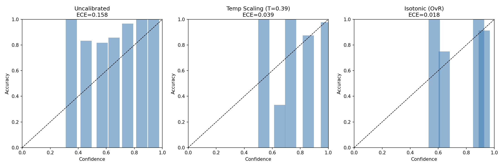

# Calibration Comparison Report (VAL Set)

Calibration evaluated on the **validation partition** (`dataset/processed/split_val.csv`), which is **separate** from the final test set (`dataset/clean_final_test.csv`).

## Metrics

| Method | ECE (10-bin) | Adaptive ECE | Mean Brier | NLL |
| --- | --- | --- | --- | --- |
| Uncalibrated (LR) | 0.1581 | 0.1581 | 0.0289 | 0.2663 |
| Temperature Scaling (T=0.393) | 0.0387 | 0.0303 | 0.0187 | 0.1381 |
| Isotonic Regression (OvR) | 0.0184 | 0.014 | 0.0105 | 0.0731 |

Temperature scaling fitted T = **0.3929** (minimising NLL on val).

## Saved artifacts

- `models/calibration/temperature.json`
- `models/calibration/isotonic_Anumana.pkl`
- `models/calibration/isotonic_Pratyaksha.pkl`
- `models/calibration/isotonic_Shabda.pkl`
- `models/calibration/isotonic_Upamana.pkl`

## Reliability diagrams

## Interpretation

Lower ECE, Brier, and NLL indicate better calibration. The best-performing calibration method should be applied at inference time for the final test evaluation. Confidence values in the API remain ranking signals; calibrated probabilities come from the selected calibrator.
