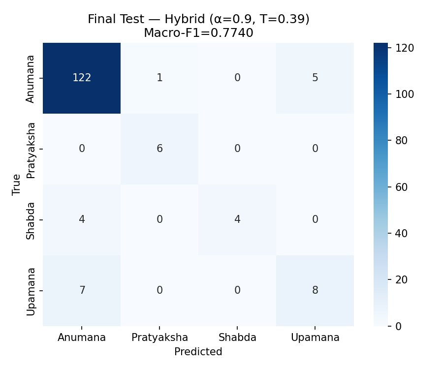

# Final Test Evaluation — InferAI

> [!IMPORTANT]
> These results were produced by a single evaluation pass on the **untouched** final test partition (`dataset/clean_final_test.csv`, n=157). No model selection, hyperparameter tuning, alpha sweep, or calibration fitting was performed on this partition. Frozen run record: `dataset/split_manifests/final_evaluation_run.json`.

- **Timestamp (UTC):** 2026-08-06T10:25:12.142026+00:00
- **Alpha:** 0.9 (selected on VAL set)
- **Temperature T:** 0.3929 (fitted on VAL set)
- **Test rows:** 157

## Summary

| System | Accuracy | Macro-P | Macro-R | Macro-F1 | ECE |
| --- | --- | --- | --- | --- | --- |
| SBERT+LR (uncalibrated) | 0.8917 [0.8344–0.9363] | 0.8475 | 0.7466 | 0.7740 [0.6136–0.8716] | 0.1044 |
| SBERT+LR (T=0.39) | 0.8917 [0.8344–0.9363] | 0.8475 | 0.7466 | 0.7740 [0.6136–0.8716] | 0.0554 |
| Hybrid α=0.9 (T=0.39) | 0.8917 [0.8344–0.9363] | 0.8475 | 0.7466 | 0.7740 [0.6136–0.8716] | nan |

*95% bootstrap CIs shown in brackets (N=2000, seed=99).*

## Per-class reports

### SBERT+LR (uncalibrated)

```text
              precision    recall  f1-score   support

     Anumana     0.9173    0.9531    0.9349       128
  Pratyaksha     0.8571    1.0000    0.9231         6
      Shabda     1.0000    0.5000    0.6667         8
     Upamana     0.6154    0.5333    0.5714        15

    accuracy                         0.8917       157
   macro avg     0.8475    0.7466    0.7740       157
weighted avg     0.8904    0.8917    0.8860       157
```

### SBERT+LR (T=0.39)

```text
              precision    recall  f1-score   support

     Anumana     0.9173    0.9531    0.9349       128
  Pratyaksha     0.8571    1.0000    0.9231         6
      Shabda     1.0000    0.5000    0.6667         8
     Upamana     0.6154    0.5333    0.5714        15

    accuracy                         0.8917       157
   macro avg     0.8475    0.7466    0.7740       157
weighted avg     0.8904    0.8917    0.8860       157
```

### Hybrid α=0.9 (T=0.39)

```text
              precision    recall  f1-score   support

     Anumana     0.9173    0.9531    0.9349       128
  Pratyaksha     0.8571    1.0000    0.9231         6
      Shabda     1.0000    0.5000    0.6667         8
     Upamana     0.6154    0.5333    0.5714        15

    accuracy                         0.8917       157
   macro avg     0.8475    0.7466    0.7740       157
weighted avg     0.8904    0.8917    0.8860       157
```

## Confusion matrix (Hybrid system)

| True\Pred | Anumana | Pratyaksha | Shabda | Upamana |
| --- | --- | --- | --- | --- |
| Anumana | 122 | 1 | 0 | 5 |
| Pratyaksha | 0 | 6 | 0 | 0 |
| Shabda | 4 | 0 | 4 | 0 |
| Upamana | 7 | 0 | 0 | 8 |


