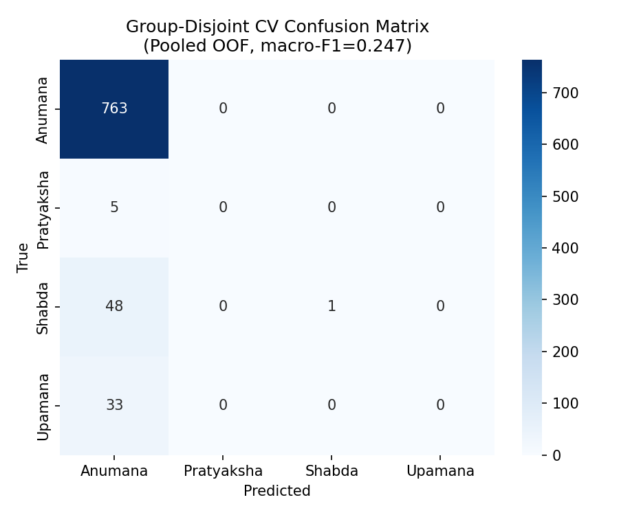

# Group-Disjoint Cross-Validation (Real-World Corpus)

**Reviewer fix M-15**: Stratified row-level CV replaced with `StratifiedGroupKFold` using `essay_id` (AAEC) and `topic_group` (IBM ArgKP) as group keys. Zero group overlap verified per fold.

**Dataset**: 850 rows, 243 unique groups, 5 folds.

## Class distribution

| count | count |
| --- | --- |
| Anumana | 763 |
| Shabda | 49 |
| Upamana | 33 |
| Pratyaksha | 5 |

## Per-fold results

| fold | n_train | n_val | n_train_groups | n_val_groups | accuracy | macro_precision | macro_recall | macro_f1 |
| --- | --- | --- | --- | --- | --- | --- | --- | --- |
| 1 | 679 | 171 | 194 | 49 | 0.8947 | 0.4735 | 0.2708 | 0.2745 |
| 2 | 681 | 169 | 192 | 51 | 0.9053 | 0.2263 | 0.25 | 0.2376 |
| 3 | 681 | 169 | 199 | 44 | 0.9053 | 0.2263 | 0.25 | 0.2376 |
| 4 | 678 | 172 | 188 | 55 | 0.8837 | 0.2209 | 0.25 | 0.2346 |
| 5 | 681 | 169 | 199 | 44 | 0.9053 | 0.2263 | 0.25 | 0.2376 |
| mean |  |  |  |  | 0.8989 | 0.2747 | 0.2542 | 0.2444 |
| std |  |  |  |  | 0.0096 | 0.1112 | 0.0093 | 0.0169 |

## Pooled OOF

| Metric | Value |
|---|---:|
| Accuracy | 0.8988 |
| Macro Precision | 0.4747 |
| Macro Recall | 0.2551 |
| Macro F1 | 0.2467 |

## Pooled OOF classification report

```text
              precision    recall  f1-score   support

     Anumana     0.8987    1.0000    0.9467       763
  Pratyaksha     0.0000    0.0000    0.0000         5
      Shabda     1.0000    0.0204    0.0400        49
     Upamana     0.0000    0.0000    0.0000        33

    accuracy                         0.8988       850
   macro avg     0.4747    0.2551    0.2467       850
weighted avg     0.8644    0.8988    0.8521       850
```

## Confusion matrix (pooled OOF)

| index | Anumana | Pratyaksha | Shabda | Upamana |
| --- | --- | --- | --- | --- |
| Anumana | 763 | 0 | 0 | 0 |
| Pratyaksha | 5 | 0 | 0 | 0 |
| Shabda | 48 | 0 | 1 | 0 |
| Upamana | 33 | 0 | 0 | 0 |



## Group disjointness verification

All folds confirmed zero group overlap between train and val partitions. Each AAEC essay and each IBM ArgKP topic appears in exactly one fold's validation set.

## Comparison with previous row-level CV

| Metric | Previous (row-level) | Current (group-disjoint) | Δ |
|---|---:|---:|---:|
| Accuracy | 0.9118 | 0.8988 | -0.0130 |
| Macro F1 | 0.3414 | 0.2467 | -0.0947 |

*Δ shows the effect of controlling for document/topic leakage. Negative Δ indicates the previous CV overestimated generalization.*
