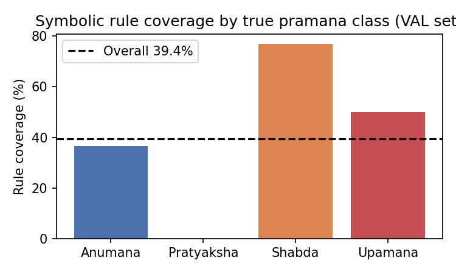

# Rule Coverage and Explainability Report

**Reviewer fix MISS-4**: Quantitative rule coverage analysis. An explainability rating sheet has been prepared for human evaluation.

## Overall coverage

| Metric | Value |
|---|---:|
| Total predictions | 160 |
| Predictions with ≥1 rule match | 63 (39.4%) |
| Predictions with NO rule match | 97 (60.6%) |
| Accuracy (rule covered) | 0.9683 |
| Accuracy (no rule) | 0.9588 |

**Interpretation:** For predictions with no rule match, the explanation falls back to embedding-space SHAP values, which are not human-readable token-level justifications. This must be disclosed in the paper.

## Per-class coverage

| pramana_label | total | covered | coverage_pct |
| --- | --- | --- | --- |
| Anumana | 129 | 47 | 36.4% |
| Pratyaksha | 6 | 0 | 0.0% |
| Shabda | 13 | 10 | 76.9% |
| Upamana | 12 | 6 | 50.0% |

## Agreement analysis

| Condition | Accuracy |
|---|---:|
| ML and rule agree | 1.0000 |
| ML and rule disagree | 0.8889 |

## Human evaluation (pending)

The rating sheet `reports/explainability_rating_sheet.csv` contains 100 sampled predictions (25 per class) with system explanations. Two raters should independently score each explanation on:

- **Correctness** (1–5): Does the matched rule/cue actually justify the predicted label?
- **Usefulness** (1–5): Does the explanation help a user understand the system's reasoning?

Inter-rater agreement (Krippendorff's α or Cohen's κ) must be reported. Results will be added to this section after rating.

## Explainability coverage claim

The paper should state:

> Symbolic rule evidence was available for 39.4% of predictions. For the remaining 60.6%, the explanation relies on embedding-space attributions (SHAP), which provide feature-level but not human-readable textual justifications.
