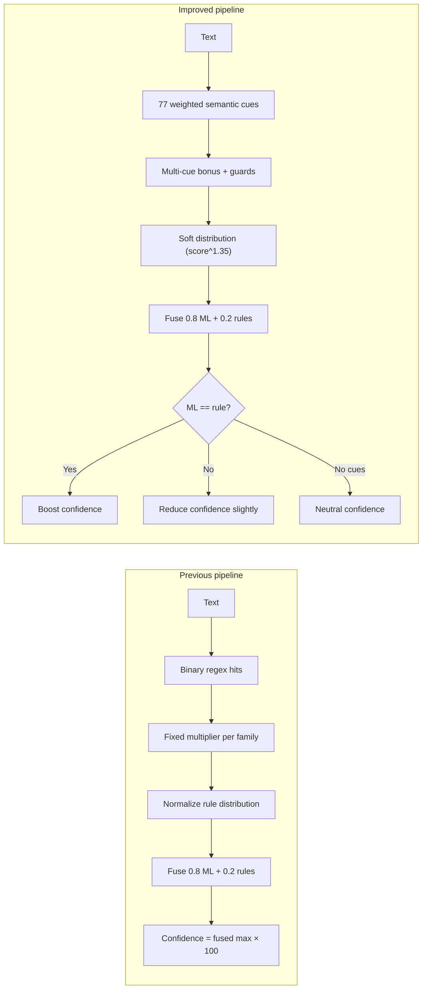

# Symbolic Rule Engine Improvements

**Scope:** `classification/hybrid_reasoning.py` only. No changes to Sentence-BERT, logistic regression, training data, API routes, or frontend.

**Date:** June 2026

---

## 1. Files reviewed

| File | Role |
|------|------|
| `classification/hybrid_reasoning.py` | Weighted cue extraction, rule distribution, ML–rule fusion (**updated**) |
| `confidence_engine/confidence.py` | Rounds confidence to two decimals (unchanged) |
| `reasoning_strength/composite.py` | Uses `detect_pattern_signals()` for structural strength (unchanged; benefits from richer signals) |
| `api/app.py` | Calls `hybrid_fuse()`; existing response keys preserved; new fields added under `hybrid` |

---

## 2. Summary of changes

| Aspect | Before | After |
|--------|--------|-------|
| Rule count | ~28 boolean patterns | **77 weighted semantic cues** |
| Scoring | Binary hit count × fixed multiplier (1.2–1.4) | **Per-cue weights (0.7–3.4)** + multi-cue bonus |
| Shabda tiering | Flat `according to` | **Tiered:** WHO/CDC (3.4) > experts/study (2.7) > informal friend (0.7) |
| Upamana safety | Included bare `like a` | **Phrase-level only**; blocks `I like …` false positives |
| Shabda safety | `studies` matched anywhere | **Skips** “he/she studies …” unless research context present |
| Hybrid confidence | `fused_max × 100` only | **Agreement boost (+10%, +4 pts)** or **disagreement reduce (−10%)** |
| Transparency | Hit counts only | **`rule_scores`, `matched_cues`, `ml_label`, `rule_label`, `agreement`** |

---

## 3. Scoring strategy

### 3.1 Weighted cue accumulation

Each rule is a `(regex, weight, pramāṇa, cue_name)` tuple. When a pattern matches:

1. Its **weight is added** to that pramāṇa’s raw score.
2. The match is recorded in `matched_cues` with span text for explainability.
3. **Longer, more specific patterns run first** (e.g. `according to WHO` before generic `according to`).

### 3.2 Weight tiers (examples)

| Tier | Example cue | Weight |
|------|-------------|--------|
| Strong official testimony | `according to WHO`, `CDC`, `court judgement` | 2.7–3.4 |
| Research testimony | `research shows`, `study found`, `medical guidelines` | 2.2–2.7 |
| General authority | `according to`, `experts`, `published` | 1.5–2.0 |
| Weak / informal | `according to my friend` | **0.7** |
| Strong perception | `microscope`, `laboratory`, `measured values`, `sensor` | 1.8–2.3 |
| Strong analogy | `works like`, `acts like`, `analogous to` | 2.4–2.6 |
| Strong inference | `therefore`, `if…then`, `therefore it follows` | 2.1–2.5 |

### 3.3 Multi-cue bonus

When **multiple distinct cues** fire within the same pramāṇa:

```
bonus = min(0.36, 0.12 × (n_cues − 1))
adjusted_score = raw_score × (1 + bonus)
```

Example: laboratory + sensor + measured + temperature → Pratyaksha score 14.28 (vs ~11.5 without bonus).

### 3.4 Rule distribution (softmax-like)

Raw scores are converted to a probability vector:

```
score[class] = 1.0 + raw[class]^1.35
```

- Baseline mass `1.0` per class prevents zeroing out unused pramāṇas.
- Exponent **1.35** sharpens the distribution when cues are strong.
- **Mix penalty (×0.88)** when ≥3 pramāṇa families fire (mixed rhetorical style).

### 3.5 Hybrid fusion

```
fused = 0.8 × p_ml + 0.2 × p_rules   (normalized)
```

**Confidence adjustment** (only when symbolic cues are present):

| Condition | Adjustment |
|-----------|------------|
| ML argmax == rule argmax | `min(99.5, fused×100×1.10 + 4.0)` |
| ML argmax ≠ rule argmax | `max(5.0, fused×100×0.90)` |
| No symbolic cues | Neutral: `fused×100` (no boost/penalty) |

Both `ml_label` and `rule_label` are always returned when symbolic evidence exists; the API continues to expose `predicted_pramana` (ML) and `hybrid_predicted_pramana` (fused argmax).

---

## 4. Rules added (77 total)

### 4.1 Pratyaksha — Perception (23 cues)

| Cue | Weight |
|-----|--------|
| observed | 1.6 |
| measured | 1.8 |
| recorded | 1.5 |
| detected | 1.6 |
| sensor / sensor data | 2.0 |
| temperature | 1.4 |
| pressure | 1.4 |
| laboratory / laboratories | 2.2 |
| experiment / experimental | 2.1 |
| sample / samples | 1.7 |
| microscope | 2.3 |
| evidence collected | 2.0 |
| survey results | 1.9 |
| statistics | 1.6 |
| measured values | 2.2 |
| inspection | 1.5 |
| monitoring | 1.5 |
| first-person observation (I saw/heard/observed…) | 1.8 |
| instrument reading (the sensor/display/log…) | 1.7 |
| we measured | 2.0 |
| telemetry | 1.8 |
| field notes | 1.6 |
| visible / audible | 1.4 |

### 4.2 Shabda — Authority (24 cues)

| Cue | Weight |
|-----|--------|
| according to official body (WHO, CDC, UNESCO, government, court…) | **3.4** |
| according to expert/study/research/journal/guidelines | **2.7** |
| according to informal source (my friend, my mom…) | **0.7** |
| according to (general fallback) | 1.5 |
| reported by | 2.0 |
| research shows | 2.5 |
| study found | 2.5 |
| journal | 2.0 |
| published | 1.9 |
| WHO (standalone) | 3.2 |
| UNESCO | 3.0 |
| CDC | 3.0 |
| government | 2.4 |
| official report | 2.6 |
| court judgement | 2.7 |
| experts | 2.0 |
| scientists | 2.1 |
| researchers | 2.0 |
| medical guidelines | 2.5 |
| evidence suggests | 2.2 |
| study / studies (research context) | 1.6 |
| report / reported | 1.5 |
| authoritative document (handbook, manual, statute) | 2.0 |
| professor / teacher | 1.4 |

**Guard:** `study/studies` is **skipped** for academic phrasing such as *“He studies biology”* unless research-context words (`research`, `journal`, `published`, etc.) are also present.

### 4.3 Upamana — Analogy (13 cues)

| Cue | Weight |
|-----|--------|
| similar to | 2.4 |
| just as | 2.3 |
| acts like | 2.5 |
| works like | 2.5 |
| resembles | 2.4 |
| analogous to | 2.6 |
| compared with / compared to | 2.2 |
| comparison | 1.8 |
| metaphor | 2.3 |
| in the same way | 2.4 |
| as if | 2.2 |
| is like | 2.4 |
| like a / like an | 2.0 |

**Guards:** No bare `\blike\b`. Patterns such as *“I like football”* and *“would like”* do not contribute Upamana evidence.

### 4.4 Anumana — Inference (17 cues)

| Cue | Weight |
|-----|--------|
| because | 2.0 |
| therefore | 2.3 |
| thus | 2.0 |
| hence | 2.1 |
| consequently | 2.2 |
| implies | 2.1 |
| suggests | 1.6 |
| likely | 1.5 |
| causes | 2.0 |
| if … then (≤40 chars) | 2.4 |
| due to | 2.0 |
| results in | 2.1 |
| leads to | 2.1 |
| therefore it follows | 2.5 |
| since | 1.7 |
| which suggests | 1.9 |
| most likely | 1.8 |

**Note:** `evidence suggests` is routed to **Shabda** (testimony); bare `suggests` remains under Anumana.

---

## 5. Worked examples

### 5.1 Shabda — tiered authority

**Text:** *“According to WHO, vaccination reduces infection rates.”*

| | Before | After |
|---|--------|-------|
| Rule hits | 2 (`according to`, `who`) | 3 weighted cues: official-body (3.4), WHO (3.2), multi-cue bonus |
| Shabda raw score | ~2.6 (2 × 1.3) | **7.39** |
| Rule label | Shabda | Shabda |
| ML label | Anumana (95.5%) | Anumana (95.5%) |
| Hybrid label | Anumana | Anumana |
| Adjusted confidence | ~77.5% (no adjustment) | **69.7%** (disagreement −10%) |
| Interpretation | Rules nudged Shabda weakly | Rules strongly identify Shabda; confidence reduced because ML disagrees — both labels visible in `hybrid` payload |

**Text:** *“According to my friend, the cafe is good.”*

| | Before | After |
|---|--------|-------|
| Shabda score | ~1.3 (1 hit) | **0.7** (informal tier only) |
| Effect | Same weight as any `according to` | Clearly weaker than WHO/CDC testimony |

### 5.2 Pratyaksha — rich measurement cues

**Text:** *“The sensor recorded a temperature of 38°C in the laboratory sample.”*

| | Before | After |
|---|--------|-------|
| Observation hits | ~2 (`sensor`, `we measured` partial) | **5 cues:** sensor, recorded, temperature, laboratory, sample |
| Pratyaksha score | ~2.8 | **14.28** |
| ML / rule agreement | — | **Both Pratyaksha** |
| Hybrid label | Pratyaksha | Pratyaksha |
| Adjusted confidence | ~59.9% | **69.8%** (+10% boost, +4 pts) |

### 5.3 Upamana — analogy without false positives

**Text:** *“The engine works like a pump, moving fluid through the system.”*

| | Before | After |
|---|--------|-------|
| Analogy hits | 1 (`works like`) | 1 (`works like`, weight 2.5 + bonus) |
| Upamana score | ~1.3 | **5.04** |
| ML / rule | Both Upamana | Both Upamana |
| Adjusted confidence | ~79.7% | **91.7%** (agreement boost) |

**Text:** *“I like football on weekends.”*

| | Before | After |
|---|--------|-------|
| Analogy hits | 0 | 0 |
| Rule label | Anumana (uniform tie-break) | **None** (no symbolic evidence) |
| Confidence adjustment | N/A | **Neutral** (no false agreement boost) |

**Text:** *“He studies biology at the university.”*

| | Before | After |
|---|--------|-------|
| Shabda hit | 1 (`studies`) | **0** (academic guard) |
| Rule label | Shabda (false positive) | **None** |

### 5.4 Anumana — mixed inference + observation

**Text:** *“Rain was observed; therefore the match was cancelled.”*

| | Before | After |
|---|--------|-------|
| Inference hits | 1 (`therefore`) | 1 (`therefore`, 2.3) |
| Observation hits | 1 (`observed`) | 1 (`observed`, 1.6) |
| Rule label | Anumana (inference weighted higher) | **Anumana** |
| ML / rule agreement | Yes | Yes |
| Adjusted confidence | ~52.7% | **61.9%** (boost) |

### 5.5 Mixed Shabda + Anumana

**Text:** *“Research shows that exercise improves mood, hence it should be recommended.”*

| | After |
|---|-------|
| Shabda cues | `research shows` (2.5) |
| Anumana cues | `hence` (2.1) |
| Rule label | **Shabda** (slightly higher raw score) |
| ML label | Anumana |
| Confidence | **Reduced** (disagreement) — both predictions reported |

---

## 6. Before vs after reasoning behaviour



**Behavioural differences:**

1. **Richer semantics:** Laboratory, survey, microscope, and monitoring language now materially strengthens Pratyaksha instead of relying on a handful of perception verbs.
2. **Graded testimony:** Official sources dominate informal hearsay; `according to my friend` contributes less than `according to WHO`.
3. **Safer analogy detection:** Colloquial *like* and academic *studies* no longer pollute Upamana/Shabda scores.
4. **Calibrated hybrid confidence:** Agreement between ML and symbolic heads increases reported confidence; disagreement lowers it while preserving both labels for inspection.
5. **Explainability:** API consumers can inspect `hybrid.matched_cues`, `hybrid.rule_scores`, and `hybrid.agreement` without changing endpoint paths.

---

## 7. API compatibility

Existing `/analyze` response keys are unchanged:

- `predicted_pramana` — ML argmax
- `hybrid_predicted_pramana` — fused argmax
- `confidence` / `adjusted_confidence`
- `hybrid` — now includes `ml_label`, `rule_label`, `rule_scores`, `matched_cues`, `agreement`

No route signatures or frontend code were modified.

---

## 8. Limitations and future work

- **ML weight (0.8) still dominates** strong symbolic evidence on held-out-style Anumana-heavy ML posteriors; rules primarily **nudge** borderline cases and **calibrate confidence**.
- **English-only** regex cues; no embedding-based rule matching.
- **Overlapping cues** (`suggests` vs `evidence suggests`) use pattern specificity rather than full syntactic parsing.
- Optional next step (out of scope here): dynamically raise `rule_weight` when symbolic score exceeds a threshold and ML confidence is low.
